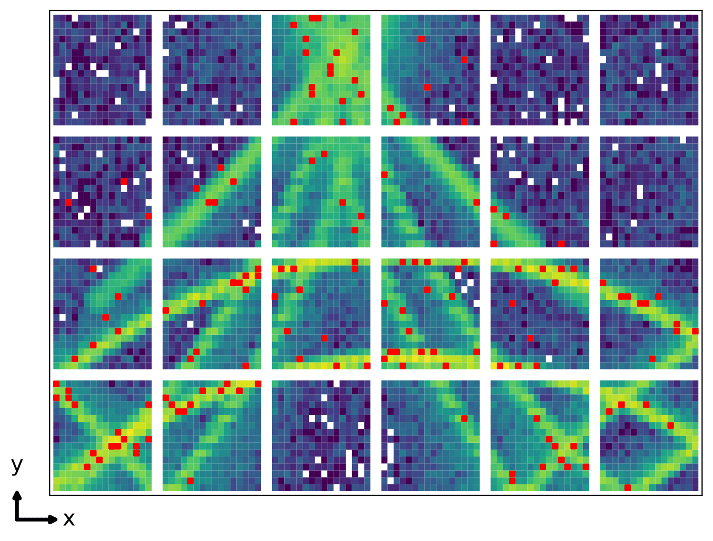
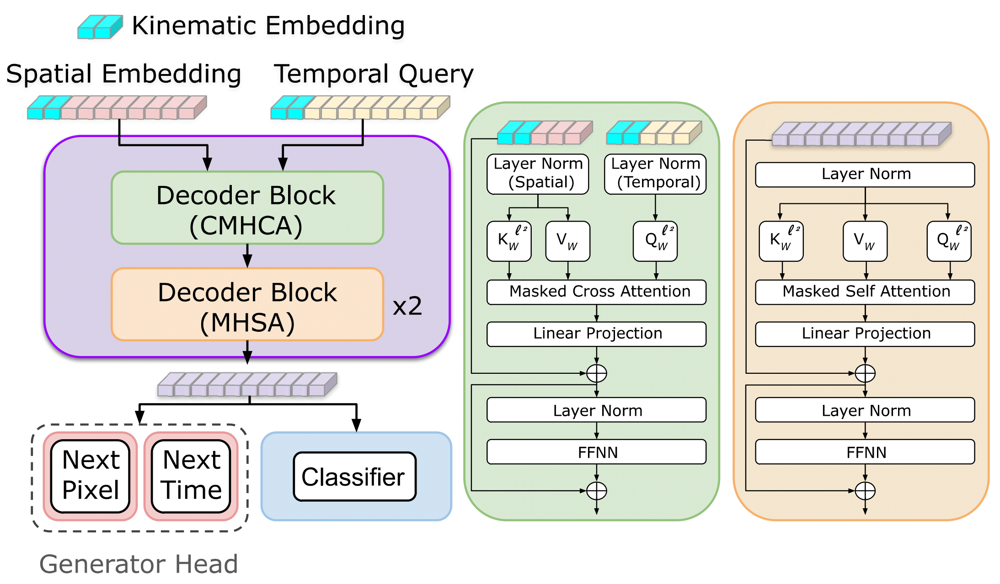

# [Towards Foundation Models for Experimental Readout Systems Combining Discrete and Continuous Data](https://arxiv.org/abs/2505.08736)

# Abstract

We present a (proto) Foundation Model for Nuclear Physics, capable of operating on low-level detector inputs from Imaging Cherenkov Detectors at the future Electron Ion Collider. To address limitations in existing next-token prediction approaches—namely resolution loss from VQ-VAE tokenization and lack of conditional generation—we propose three key innovations: (i) separate vocabularies for discrete spatial features and continuous variates, combined via Causal Multi-Head Cross-Attention (CMHCA), (ii) continuous kinematic conditioning through prepended context embeddings, and (iii) scalable and simple, high-resolution continuous variate tokenization without joint vocabulary inflation. Our model enables fast, high-fidelity generation of pixel and time sequences for Cherenkov photons, validated through closure tests in the High Performance DIRC. We also show our model generalizes to reconstruction tasks such as pion and kaon identification, in which we show its ability to leverage fine-tuning.



# Contents
- [Data used for Training](#Section-1)
- [Environment](#Section-2)
- [Architecture](#Section-3)
- [Usage](#Section-4)


# Data used for Training

The data used for training our generative models was created using a standalone simulation, and is the same as used in [Generative Models for Fast Simulation of Cherenkov Detectors at the Electron-Ion Collider](https://arxiv.org/abs/2504.19042). More details can be found at [eicdirc](https://github.com/rdom/eicdirc). Our dataset was constructed over a singular bar (no azimuthal angle variance), and without magnetic field. 

# Environment 

Noteable requirements: 

- Python:     3.12.8
- Pytorch:    2.5.1
- CUDA:       12.4

The dependencies for the networks can be installed with the following command:

```bash
conda env create -f env.yml
```

In the case that some packages do not install through the provided conda command, you can install them using pip once your conda environment is activated:

```bash
python3 -m pip install <package>
```

Note this environment is intended to be compatible with our previous work [Generative Models for Fast Simulation of Cherenkov Detectors at the Electron-Ion Collider](https://arxiv.org/abs/2504.19042)


# Architecture



We use a transformer architecture for generation of charged particle tracks in Cherenkov Detectors. The architecture is also capable of classifying charged tracks as originating from Pions, or Kaons. Key architectural features include:

- **Kinematic Conditioning**: Momentum and angle (fully continuous) are embedded and prepended to both spatial and time token sequences.
- **Independent Embeddings**: Spatial and time vocabularies are embedded separately using learnable projections and independent positional encodings.
- **Causal Multi-Head Cross Attention (CMHCA)**: The model uses time embeddings to query spatial embeddings, fusing the modalities with cross-attention to be processed by traditional transformer blocks.
- **Transformer Blocks**:
  - 8 attention heads (CMHCA,MHSA,MHSA)
  - GeLU activations
  - Pre/post normalization layers
  - $\ell_2$ normalization of Q/K matrices for scale invariance and stability
- **Output Heads**: Supports dual-token prediction (space and time) or class prediction.
- **Class-Specific Training**: Separate models are trained for generation of pions and kaons to maximize fidelity in the high-momentum regime.

## Example Tokenization

Time and space stem from independent vocabularies - given that the mapping between space and time is many-to-many, the approximation holds. The independent sequences are merged within the model, and then predicted from independent heads. Example sequences are given below.

```
spatial → {|p|, θ, SOSₚ, p₁, ..., pₙ, EOSₚ}
time    → {|p|, θ, SOSₜ, t₁, ..., tₙ, EOSₜ}
```

# Usage 

Note we have provided all code required to reproduce the results found within the paper, although these require large amounts of simulation from GEANT4. For those interested in training their own models, or reproducing our work, please open an issue. If their exists a high demand, we will update our documentation to and provide instructions for dataset creation, or directly share the datasets permitted.

## Training

Training is configuration file based for both the generative models, and the classification models. To train the generative models, first update the CA_config.json file with an appropriate **name** field, and set the method to either pions or kaons. Once completed, training can be ran through the following command:

```
python train.py --config config/CA_config.json
```

For classification, training functions in a similar manner - in which all parameters are configuration file based (.json). We also provide an option for fine-tuning from pre-trained generative models. 

```
python train_classification.py --config config/CA_config.json --fine_tune_path /path/to/pre/trained/gen/model.pth
```

## Evaluation

As mentioned prior, the datasets surrounding this study are large, and therefore we do not provide access to them directly (refer the top of this section). If datasets are available, classifcation models can be evaluated through the provided .sh script at varrying momentum values. Note that these files will be placed in the **out_dir_fixed** filed of the config file.

```
./eval_classifier_fixed.sh
```

Evaluation of generative model fidelity is done through a Kernel Density Estimation based Particle Idenfication script. Essentially translating generation quality to a more meaningful metric, separation power. If datasets are available, you can run the evaluation using the following command:

```
python run_FastDIRC.py --config config/CA_config.json --momentum {} --fs_support {} --geant_support {}
```

The location of these fields corresponds to the **KDE_dir** field in the config file.

## Running Fast Simulation 

We have provided an example script to allow simulation at both fixed kinematics, and continuously over the phase space. An example command and argument details is provided below:

```
python run_simulation.py --config config/CA_config.json --n_tracks {} --n_dump {} --method {} --momentum {} --theta {} --dark_rate 
```

| Argument               | Type    | Default          | Description                                                              |
|------------------------|---------|------------------|--------------------------------------------------------------------------|
| `--config`             | `str`   | `CA_config.json` | Path to the config file                                                  |
| `--n_tracks`           | `int`   | `1e5`            | Number of particles to generate. Take the first `n_tracks`               |
| `--n_dump`             | `int`   | `None`           | Number of particles to dump per `.pkl` file                              |
| `--method`             | `str`   | `"MixPiK"`       | Generated particle type (`Kaon`, `Pion`, or `MixPiK`)                    |
| `--distributed`        | `flag`  | `False`          | Trained with multiple GPUs (DDP)                                         |
| `--momentum`           | `str`   | `"6"`            | Momentum value or range                                                  |
| `--theta`              | `str`   | `"30"`           | Theta value or range                                                     |
| `--dark_noise`         | `flag`  | `False`          | Include hits from dark noise (see source code for details)               |
| `--temperature`        | `float` | `1.05`           | Generation temperature                                                   |
| `--dynamic_temperature`| `flag`  | `False`          | Use dynamic temperature (see source code for details)                    |
| `--sampling`           | `str`   | `"Nucleus"`      | Sampling strategy: `Default`, `TopK`, or `Nucleus`                       |
| `--topK`               | `int`   | `300`            | TopK value (used if sampling = `TopK`)                                   |
| `--nucleus_p`          | `float` | `0.995`          | Nucleus P value (used if sampling = `Nucleus`)                           |


## Hit Pattern Creation 

We have provided an example script to generate visualizations of hit patterns at fixed momentum (user provided), and over various theta in 5 degree bins. This will be done for both pions and kaons within the same script by default.

```
python plot_PDF.py --config config/config.json --method {} --momentum {}  --fs_support {}
```

| Argument               | Type    | Default          | Description                                                              |
|------------------------|---------|------------------|--------------------------------------------------------------------------|
| `--config`             | `str`   | `CA_config.json` | Path to the config file                                                  |
| `--fs_support`         | `float` | `1e5`            | Number of Fast Simulated support photons                                 |
| `--distributed`        | `flag`  | `False`          | Trained with multiple GPUs (DDP)                                         |
| `--momentum`           | `float` | `6.0`            | Momentum value or range                                                  |
| `--theta`              | `str`   | `"30"`           | Theta value or range                                                     |
| `--dark_noise`         | `flag`  | `False`          | Include hits from dark noise (see source code for details)               |
| `--temperature`        | `float` | `1.05`           | Generation temperature                                                   |
| `--dynamic_temperature`| `flag`  | `False`          | Use dynamic temperature (see source code for details)                    |
| `--sampling`           | `str`   | `"Nucleus"`      | Sampling strategy: `Default`, `TopK`, or `Nucleus`                       |
| `--topK`               | `int`   | `300`            | TopK value (used if sampling = `TopK`)                                   |
| `--nucleus_p`          | `float` | `0.995`          | Nucleus P value (used if sampling = `Nucleus`)                           |


# Citations

```
@misc{giroux2025foundationmodelsexperimentalreadout,
      title={Towards Foundation Models for Experimental Readout Systems Combining Discrete and Continuous Data}, 
      author={James Giroux and Cristiano Fanelli},
      year={2025},
      eprint={2505.08736},
      archivePrefix={arXiv},
      primaryClass={cs.LG},
      url={https://arxiv.org/abs/2505.08736}, 
}
```

Previous work from which we inherit the dataset.

```
@misc{giroux2025generativemodelsfastsimulation,
      title={Generative Models for Fast Simulation of Cherenkov Detectors at the Electron-Ion Collider}, 
      author={James Giroux and Michael Martinez and Cristiano Fanelli},
      year={2025},
      eprint={2504.19042},
      archivePrefix={arXiv},
      primaryClass={physics.ins-det},
      url={https://arxiv.org/abs/2504.19042}, 
}
```